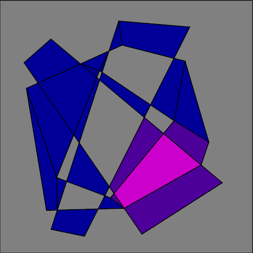

# Simple Tesselation Vizualizer

Uses [libtess2](https://github.com/AdyanOchirov/libtess2-zig) for tesselation and [dvui](https://github.com/david-vanderson/dvui) for rendering.
Allows you to input series of closed line contours and see the tesselation results with different options.
